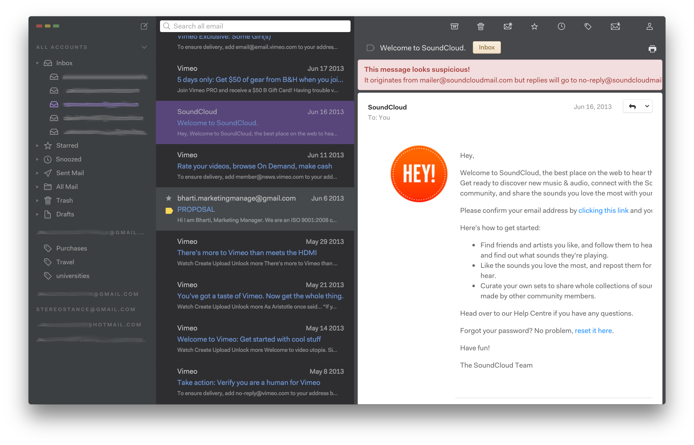
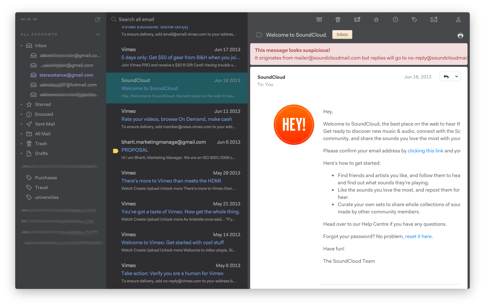
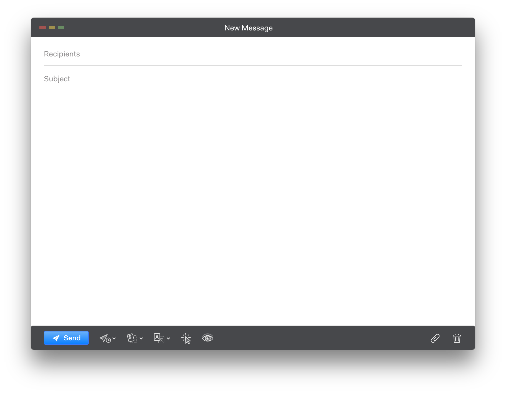
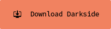
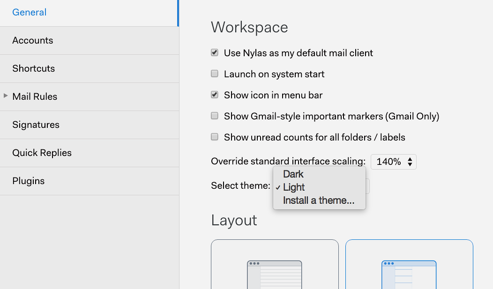

# 80's Baby theme
A fork of the customizable, dark sidebar theme for [Nylas N1](https://nylas.com/n1).
Made to match [Bracket's 80's Baby theme](https://github.com/Brackets-Themes/80sBaby).

[](./images/active.png)
[](./images/inactive.png)
[](./images/composer.png)

[See other example themes →](http://jamiewilson.io/darkside)

## Installation

### Step 1: Download

#### Option 1: via the command line  
`git clone https://github.com/Porco-Rosso/darkside.git ~/.nylas/packages/darkside-master`

**Note:** _Be sure to clone the repo as `darkside-master` or else images referenced in the CSS won't be found._

<!--
#### Option 2: the ZIP archive  
[](https://github.com/jamiewilson/darkside/archive/master.zip)
-->

Then, unzip `darkside-master.zip`.

### Step 2: Install
Open the Nylas N1 Preferences panel with <kbd>Cmd</kbd> + <kbd>,</kbd> or `Nylas N1 > Preferences` and choose `Install a theme…` from the `Select Theme` dropdown.



### Step 3: Activate
Select the `darkside-master` folder and press `Open`. N1 will make a copy of the theme files into your `.nylas/packages` directory, notify you that the theme has been installed, and open it a new Finder window.

If you need to get back to the package files, they're located at `/Users/<yourUsername>/.nylas/packages/darkside-master`. Either use Terminal or you can open a Finder window and press <kbd>Cmd</kbd> + <kbd>Shift</kbd> + <kbd>G</kbd> and paste the path in, replacing `<yourUsername>` with your username.

### Step 3: Customize
To customize Darkside, open `darkside-master/styles/darkside.less` in a text editor.

**To change colors, just comment out the default `@sidebar` and `@accent` variables and uncomment another theme or simply replace with your own colors.**

```sass
// Default
@sidebar: #3c3f41;
@sidebar2: #47484B;
@accent: #7fb0ff;
@accent2: #BE9CFF;
@accent3: #16D3EA;
@accent4: #FD7CFC;

// Luna
// @sidebar: #202C46;
// @accent: #39DFF8;

// Zond
// @sidebar: #333333;
// @accent: #F6D49C;

// Gemini
// @sidebar: #00203C;
// @accent: #F6B312;

// Mercury
// @sidebar: #555;
// @accent: #999;

// Apollo
// @sidebar: #3A1E15;
// @accent: #F6AA1C;
```

### Feedback
If you have questions or suggestions, please add an issue.
